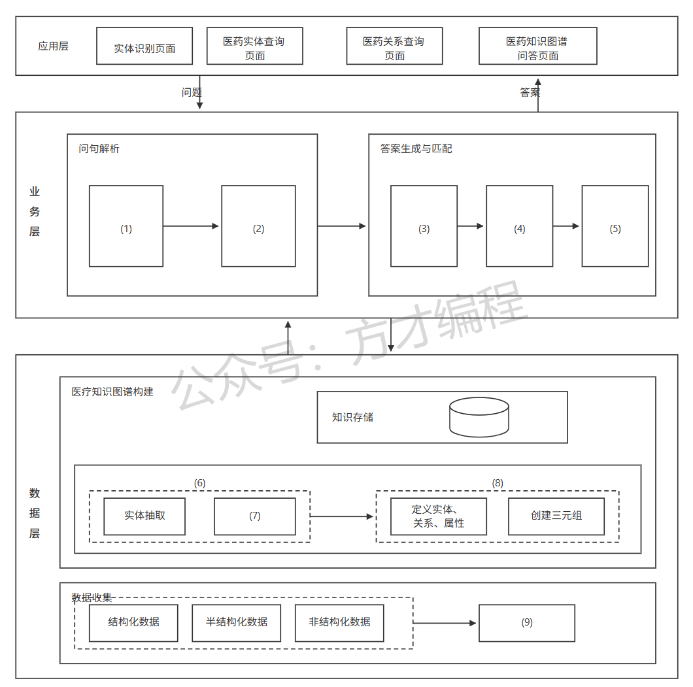

# 2025年5月 系统架构设计师 案例分析真题

---

## 第1大题：软件架构设计与评估

某公司开发一个在线大模型训练平台，支持Python代码编写、模型训练和部署，用户通过python编写模型代码，将代码交给系统进行模型代码的解析，最终由系统匹配相应的计算机资源进行输出，用户不需要关心底层硬件平台。
### 问题1
（12分）列举了所有需求列表，填写对应的质量属性：
a、系统发生错误时，不影响正常运行时发送一个消息给系统管理员
b、方便用户操作，满足一般用户使用的快捷键设置
c、系统界面适配用户提供的屏幕尺寸比例
d、用户提交训练任务时应该在一分钟内提供硬件和资源，并开始任务运行
e、数据库发生故障时，能够在 20 分钟内切换至备用数据库，保证平台继续运行
f、系统出现故障时，平台能够继续正常运行并通知管理员，同时应提供相关的操作日志、系统日志、访问日志和调试日志等信息
g、支持远程用户进行测试和操作，但需限定为注册用户
h、系统应支持来自不同终端设备（如浏览器、命令行工具、移动设备等）和操作系统（如 Windows、Linux、macOS）的注册用户同时远程访问与操作平台，系统需能正确解析并响应各类客户端的指令，保证功能一致性与协同操作能力
i、当系统功能需要调整时，应在 3 天内完成功能修改和部署上线
j、系统支持切换不同的语言，方便不同语言背景用户使用
k、服务器发生故障后，立即切换到备用服务，保证业务的连续性
l、系统需具备良好的异常容错机制，部分模块出错不应影响平台整体运行


**我的答案**

- 可用性   e  f  l  k
- 性能    d 
- 可修改性    i
-  测试性   g
- 易用性  j  a b c h 

---

**评分：约 7/12 分**

**评判：**
- ✓ 性能 (d)、可修改性 (i)、安全性 (g) 全部正确
- ✗ 可用性 (e, f, k, l) 中：
  - (e)=可用性 ✓、(k)=可用性 ✓ 正确
  - (a)="错误时不影响运行" → 标准答案是**可靠性**（容错、健壮性），不是可用性 ✗
  - (f)="故障时继续运行+日志" → 标准答案是**可靠性**（维持功能、故障不扩散），不是可用性 ✗
  - (l)=可靠性 ✓ 用户也填在了可用性中，算半对
- ✗ 易用性 (j, a, b, c, h) 中：
  - (b)=易用性 ✓、(c)=易用性 ✓、(j)=易用性 ✓ 正确
  - (a) 和 (h) 不应归易用性 ✗

---

**补充答案（标准参考）：**

| 场景 | 质量属性 | 匹配依据 |
|------|---------|---------|
| **a** | **可靠性** | 错误时不影响运行（容错、健壮性） |
| **b** | **易用性** | 快捷键设置（易操作） |
| **c** | **易用性** | 界面适配屏幕（易操作） |
| **d** | **性能** | 1分钟内启动任务（响应时间） |
| **e** | **可用性** | 20分钟内切换备用数据库（MTTR、业务不中断） |
| **f** | **可靠性** | 故障时继续运行（维持功能），日志辅助可修改性 |
| **g** | **安全性** | 限定注册用户（访问控制、授权） |
| **h** | **互操作性** | 跨终端/操作系统协同操作（与外部实体交互） |
| **i** | **可修改性** | 3天内完成功能修改（快速变更能力） |
| **j** | **易用性** | 多语言支持（易理解） |
| **k** | **可用性** | 服务器故障立即切换备用（运行时间比例） |
| **l** | **可靠性** | 部分模块出错不影响整体（故障隔离、不扩散） |


---

### 问题2
（ 13分）解释器风格架构的组成图填空（6分），以及解释为什么该模型平台**适合解释器风格**（7分）


**我的答案**

- 1 模型代码
- 2  计算机资源
- 3 系统进行模型代码解析

解释器风格：为虚拟机风格的一种，可允许用户进行自定义操作

- 因为用户给的 python 代码有可能是不同的 ，然后系统需要根据代码进行资源和的输出，这相当于一个自定义的过程，所以选择解释器风格比较好

---

**评分：约 10/13 分**

**评判：**
- 填空(1)"模型代码"方向正确（被解释执行的程序），✓
- 填空(2)"计算机资源"✗ 错误，标准答案应为**解释器/引擎**（负责读取程序并解释执行的核心组件）
- 填空(3)"系统进行模型代码解析"方向正确（解释执行引擎），✓
- 解释部分提到了"虚拟机风格"和"自定义操作"，方向正确
- 解释了选择原因：Python代码动态变化，需要系统解析后匹配资源，✓
- 缺少对解释器风格**四个核心组成部分**的描述（程序源代码、解释器引擎、计算状态、输出结果）

---

**补充答案（标准参考）：**

**解释器风格架构组成（填空）：**

| 编号 | 答案 | 说明 |
|------|------|------|
| (1) | **被解释执行的程序** | 输入的程序源代码（用户提交的 Python 代码） |
| (2) | **解释器引擎** | 读取程序、维护计算状态机、选择指令和数据、产生输出的核心组件 |
| (3) | **程序执行的当前状态 / 解释器引擎内部状态** | 存储解释执行过程中的程序状态、被选择的指令和数据 |

**该平台适合解释器风格的原因：**

1. **匹配自定义代码解析需求**：平台核心需处理用户编写的 Python 模型代码，解释器风格能直接解析、执行这类自定义脚本，无需将代码转化为底层硬件可直接运行的机器码，契合"解析用户代码"的核心场景
2. **隔离底层硬件细节**：解释器可封装底层硬件资源（如 GPU、CPU）的调用逻辑，用户无需关心硬件差异，仅需专注 Python 代码编写，符合平台"屏蔽底层"的设计目标
3. **适配灵活调整场景**：模型训练中可能涉及代码修改、参数调整，解释器支持实时解析新代码，无需重新编译或部署系统，快速响应用户的灵活调整需求
4. **契合动态执行特性**：模型训练是动态执行过程（如迭代训练、实时日志输出），解释器可逐行/逐段解析执行代码，匹配训练过程的动态性，避免静态编译的刚性限制


---

## 第2大题：系统建模与分析

公司想要建设一个医院的智能问答系统，建立医院知识图谱，某工认为互联网的关键字检索无法满足大量的数据需求，建议建立知识图谱，采用爬虫技术。


### 问题1

知识图谱一张填空的图9分。
根据题干描述的内容，将下列选项填入图中合适位置
(a)知识检索    (b)模板翻译  (c)数据清洗    (d)命名实体识别   (e)知识表示   

(f)模板匹配      (g)问题分类     (h)知识抽取    (i)关系抽取




### 问题2
建立医院知识图谱，给出一张爬虫架构图，要求按图填空。并简述异步io的特点和优势。


---
### 问题3
在构建医药知识图谱系统中，选择哪类数据库更适合存储知识图谱数据?并结合医药数据特性说明理由。


---

## 第3大题：数据库与系统设计

某互联网企业开发了一个电商系统，系统中的商品信息、用户购物车、热销榜单等高频数据均存储在 Redis 中以提高访问效率。随着业务规模扩大，**单实例 Redis 出现了性能瓶颈和单点故障风险**。为提升系统的可用性、扩展性和数据容灾能力，技术团队决定采用 Redis 的主从复制架构，将**写操作集中在主节点（Master**），将**读操作分散到多个从节点（Slave）中**。同时，系统还需支持主从自动同步机制，确保在主库故障后可以快速切换至从库，保障业务连续性。
### 问题1
（10分）redis主从同步，要求按图填空，首次全量同步过程；


**我的答案**

（1）主动从主库读取缓存数据

（2）记录从库更新缓存数据节点

（3）将写操作数据在本地进行缓存

（4）告知从节点有新的缓存数据

（5）告知目前主节点的缓存数据情况

---

**评分：约 1/10 分**

**评判：**
-  5 个空的答案全部不准确，描述的是"缓存读写"而非"Redis 主从同步流程"
- 完全偏离了 Redis 主从同步的核心概念（SYNC/PSYNC 命令、BGSAVE、RDB 传输、复制缓冲区）
- 第(3)"将写操作数据在本地进行缓存"方向上接近"将写操作追加到复制缓冲区"，但表述不准确

---

**补充答案（标准参考）：**

Redis 主从全量同步流程：

| 编号 | 标准答案 | 说明 |
|------|---------|------|
| (1) | **从库向主库发送 PSYNC -1 或 SYNC 请求** | 从库主动发起首次同步请求（PSYNC -1 表示全量复制） |
| (2) | **主库执行 BGSAVE 命令，生成 RDB 快照文件** | 主库收到请求后在后台执行 BGSAVE 生成数据快照，同时继续处理客户端写操作 |
| (3) | **主库将 BGSAVE 期间的写操作追加到 replication backlog** | 快照生成期间的增量写命令不会丢失，记录在复制积压缓冲区（backlog）中 |
| (4) | **主库通过 socket 将 RDB 文件传输给从库** | 快照生成完成后，将全量数据快照发送给从库 |
| (5) | **主库将 backlog 中积压的增量写命令发送给从库** | 从库加载完 RDB 后，主库发送 backlog 中积累的增量命令，保证数据最终一致 |

---

**扩展：BGSAVE 详细解析**（结合本题考点）

`BGSAVE`（Background Save）是 Redis 生成 **RDB 快照**的核心后台机制，也是本题主从同步流程的关键环节。

**核心概念：**
- **作用**：在后台异步生成当前 Redis 内存数据的完整快照（`.rdb` 文件），用于持久化或主从同步
- **关键特性**：**不阻塞主进程**，执行期间 Redis 仍可正常处理客户端读写请求

**底层工作原理（`fork` + COW）：**
1. Redis 主进程调用 `fork()` 创建子进程，子进程获得父进程内存空间的副本
2. **写时复制（Copy-On-Write, COW）**：fork 刚完成时父子进程共享同一块物理内存；当父进程处理写请求修改数据时，操作系统自动将被修改的内存页复制一份给子进程
3. **子进程始终看到 fork 时刻的旧数据**（保证快照一致性），**父进程继续处理新数据**（不影响业务）

**执行流程（6 步）：**
```
1. 客户端发送 BGSAVE 命令
2. Redis 主进程 fork() 生成子进程
3. 主进程继续处理客户端读写（不阻塞）
4. 子进程将内存数据写入临时 RDB 文件
   ↓ (期间主进程写操作触发 COW，子进程数据保持 fork 时刻快照)
5. 子进程写入完成，通知主进程替换旧快照
6. 主进程回收子进程资源，BGSAVE 结束
```

**BGSAVE vs SAVE（常考对比）：**

| 对比项 | `SAVE` | `BGSAVE` |
|--------|--------|----------|
| 执行方式 | 同步阻塞 | 异步后台 |
| 是否阻塞客户端 | 是 | 否 |
| 底层机制 | 主进程直接写磁盘 | fork 子进程 + COW |
| 使用场景 | 极少（仅维护窗口） | 生产环境默认 |

**在主从全量同步中的关键作用：**
- 主库收到从库 SYNC 请求后，执行 **BGSAVE** 生成 RDB 快照
- BGSAVE 执行期间，主库收到的新写命令追加到 **复制缓冲区**，不丢失
- 快照生成后，先传 RDB 文件给从库，再传缓冲区增量命令，保证最终一致


### 问题2
（6分）增量复制的流程图填空。


**我的答案**

（1）将一定时间的写数据打包为增量数据

（2）将增量数据主动发送到从库

（3）增量同步数据

---

**评分：约 2/6 分**

**评判：**
-  3 个空的描述较为笼统，没有准确描述 Redis 增量复制的具体步骤
-  (1)"将一定时间的写数据打包为增量数据"方向接近"追加到复制缓冲区"，但不够精确
-  (2)"主动发送到从库"方向正确，但缺少"偏移量(offset)匹配"的关键概念
-  (3)"增量同步数据"过于简略，应描述从库接收并应用增量命令的过程

---

**补充答案（标准参考）：**

Redis 主从增量同步流程：

| 编号 | 标准答案 | 说明 |
|------|---------|------|
| (1) | **主库将写操作追加到复制缓冲区** | 全量同步完成后，主库继续将新的写操作记录到 replication buffer |
| (2) | **主库将增量命令（带偏移量 offset）发送给从库** | 主库持续将缓冲区中的写命令发送给从库，携带复制偏移量 |
| (3) | **从库接收并执行增量命令，更新自身数据** | 从库接收增量命令后依次执行，保持与主库数据一致 |


---

### 问题3
（9分）数据库持久化方案，请列举两种，并说明。【ps：这个问题的题目并没有明确提及是Redis的持久化，
问的就是数据库的持久化，同时结合本题上下文，回答Redis的持久化机制是更加合适
】

**我的答案**

两种持久化方案

- RDB 首先将数据缓存到 redis 中，然后定期将数据同步到数据库中
- AOF 每次变更都持续需要文件中

采用 RDB 更加合适，因为电商系统会频繁写，如果每次都同步文件，会导致性能很慢；

---

**评分：约 5/9 分**

**评判：**
-  列举了 RDB 和 AOF 两种持久化方案，✓
-  RDB 描述有误："将数据同步到数据库中"是错误的，RDB 是将 Redis 内存数据生成**快照文件**（.rdb 文件），不是同步到数据库 ✗
-  AOF 描述"每次变更都持续需要文件中"表述不清，但方向正确（追加写操作到日志文件）✓
-  "采用 RDB 更加合适"的选择方向正确，电商系统高频写入场景下 RDB 性能更好 ✓
-  缺少对两种方案优缺点的系统对比：RDB（文件小、恢复快、可能丢数据）vs AOF（数据完整、文件大、恢复慢）

---

**补充答案（标准参考）：**

Redis 两种持久化方案：

**1. RDB（Redis DataBase）快照持久化：**
- **原理**：定期将 Redis 内存中的数据生成二进制快照文件（.rdb）保存到磁盘。通过 BGSAVE 命令在子进程中完成，不阻塞主进程
- **优点**：文件紧凑、恢复速度快、适合大规模数据恢复和备份
- **缺点**：两次快照之间的数据可能丢失（宕机时），不适合对数据完整性要求极高的场景

**2. AOF（Append Only File）追加日志持久化：**
- **原理**：将每个写操作以 Redis 协议格式追加到 AOF 日志文件中。支持三种 fsync 策略：always（每次写入都刷盘）、everysec（每秒刷盘）、no（由操作系统决定）
- **优点**：数据完整性高，最多丢失 1 秒数据（everysec 策略），日志追加写入性能好
- **缺点**：文件体积大、恢复速度慢、高并发写入时性能低于 RDB

**电商系统选择建议**：推荐**RDB + AOF 混合使用**。RDB 用于定期全量备份和快速恢复，AOF 保证数据完整性。如果只能选一种，高频写入场景优先选 AOF（everysec），兼顾性能和数据安全。


---

## 第4大题：Web应用架构

随着人工智能技术的发展，AI计算能力的部署方式呈现多样化趋势，主要包括**云侧AI与端侧AI**两种模式。两种部署模式各具优势，适用于不同的应用场景。
### 问题1
(6分)云端AI和端侧AI的定义以及端侧AI相比云端AI的优势是什么?

**我的答案**

- 云端AI ：AI 大模型部署在云端，部署资源可灵活扩容，实际通过网络使用 API 的方式进行访问和使用
- 端侧AI：本地客户端部署AI大模型，部署资源扩容不是很方便

端侧AI相比云端AI的优势如下

- 端侧 可以自己进行 模型 微调 和蒸馏 
- 端侧 隐私性较高，数据安全性高
- 端侧 消除网络波动影响

---

**评分：约 4/6 分**

**评判：**
-  云端 AI 定义正确（大模型部署云端，通过网络 API 访问），✓
-  端侧 AI 定义基本正确（本地客户端部署模型），但"部署资源扩容不是很方便"是**缺点**而非定义特征 ✗
-  端侧优势：
  - "自己进行模型微调和蒸馏"表述不准确——端侧资源受限，通常是在云端微调/蒸馏后部署到端侧 
  - "隐私性较高，数据安全性高"✓ 正确
  - "消除网络波动影响"✓ 正确（低延迟、离线可用）
- 缺少关键优势：**低延迟**（无需网络传输）、**离线可用**（无网络也能运行）、**节省云端带宽和算力成本**

---

**补充答案（标准参考）：**

**云端 AI 定义：**
将 AI 模型部署在云端数据中心，用户通过网络（互联网）以 API 调用的方式使用模型推理和训练能力。模型运行在强大的云服务器（GPU/TPU 集群）上。

**端侧 AI 定义：**
将 AI 模型部署在终端设备（手机、PC、IoT 设备等）本地，模型推理直接在设备端完成，无需将数据发送到云端。

**端侧 AI 相比云端 AI 的优势：**
1. **数据隐私与安全**：数据不出设备本地，避免敏感数据上传云端带来的泄露风险
2. **低延迟**：推理在本地完成，无需网络传输，响应速度更快
3. **离线可用**：无网络连接时仍可正常运行，不依赖网络稳定性
4. **节省带宽和云端成本**：减少数据传输量，降低云端计算资源消耗
5. **个性化体验**：可根据本地用户数据做个性化适配


### 问题2

---
(7分)资源池的核心架构设计需要考虑以下三个方面:

(a)资源抽象与异构计算

(b)动态调度与能效优化

(c)安全机制与隔离

下表列出了一些资源池设计方法，请将相应的类别填入下标空格处。


**我的答案**

（1）  b （2）a   （3）a  

（4）  c （5）b   （6）a

（7）c 

---

**评分：约 4/7 分**

**评判：**
- ✓ (1)=b 正确：基于优先级/能耗/NPU 加速动态分配 = **动态调度与能效优化**
- ✓ (2)=c 正确：虚拟化/容器隔离多用户 = **安全机制与隔离**（用户填了 c，但 c=安全机制与隔离？等等，让我确认类别映射）
- 实际上题目中给出的类别是 (a)资源抽象与异构计算、(b)动态调度与能效优化、(c)安全机制与隔离
- ✓ (2)=c：通过虚拟化或容器技术隔离 → 安全机制与隔离 ✓
- ✗ (3)=a：异构算力统一抽象为虚拟资源池 → 这确实是**资源抽象与异构计算** ✓ 用户填 a 正确
- ✗ (4)=c：本地数据处理避免敏感信息上传+端到端加密 → 应为**安全机制与隔离**，用户填 c ✓ 正确
- ✗ (5)=b：根据负载自动调整算力分配 → 应为**动态调度与能效优化**，用户填 b ✓ 正确
- ✗ (6)=a：近存计算优化 → 应为**资源抽象与异构计算**，用户填 a ✓ 正确
- ✗ (7)=c：模型蒸馏/量化/稀疏编码压缩体积 → 应为**资源抽象与异构计算**，用户填 c ✗ 错误

让我重新核对用户答案：
- (1) b ✓
- (2) a ✗（用户填的是 a 不是 c）

等等，让我重新看用户答案：（1）b （2）a （3）a （4）c （5）b （6）a （7）c

- (1) b = 动态调度与能效优化 ✓
- (2) a = 资源抽象与异构计算 ✗（虚拟化隔离→安全机制与隔离=c）
- (3) a = 资源抽象与异构计算 ✓
- (4) c = 安全机制与隔离 ✓
- (5) b = 动态调度与能效优化 ✓
- (6) a = 资源抽象与异构计算 ✓
- (7) c = 安全机制与隔离 ✗（模型蒸馏/量化→资源抽象与异构计算=a）

7 空答对 5 空，约 5/7 分

---

**补充答案（标准参考）：**

| 序号 | 设计方法 | 类别 | 理由 |
|------|---------|------|------|
| 1 | 基于任务优先级、能耗阈值和 NPU 加速动态分配 | **(b) 动态调度与能效优化** | 动态分配、能效优化 |
| 2 | 通过虚拟化或容器技术隔离多用户任务 | **(c) 安全机制与隔离** | 隔离、防止资源争抢 |
| 3 | 异构算力（CPU/GPU/NPU）统一抽象为虚拟资源池 | **(a) 资源抽象与异构计算** | 资源抽象、屏蔽硬件差异 |
| 4 | 本地数据处理+端到端加密 | **(c) 安全机制与隔离** | 安全加密、敏感信息保护 |
| 5 | 根据负载自动调整算力分配 | **(b) 动态调度与能效优化** | 动态调度 |
| 6 | 近存计算优化 | **(a) 资源抽象与异构计算** | 计算与存储协同优化 |
| 7 | 模型蒸馏、量化和稀疏编码压缩模型体积 | **(a) 资源抽象与异构计算** | 适配端侧硬件资源限制 |


### 问题3

请根据下列指标对比三种资源池架构，前4空填写“高”中"或“低”，后3空填写相应资源池的典型适用场景。


**我的答案**

（1）低

（2）中

（3）低

（4）高

（5）本地模型内网部署，供内网使用

（6）部署大模型，发布API服务，供很多人直接使用

（7）本地模型微调和蒸馏

---

**评分：约 6/7 分**

**评判：**
- ✓ (1)=低 正确：集中资源管理可用性低（单点故障风险）
- ✓ (2)=中 正确：混合式资源管理可用性中（兼顾集中和分布）
- ✓ (3)=低 正确：集中资源管理扩展性低
- ✓ (4)=高 正确：分布式资源管理扩展性高
- (5)(6)(7) 应用场景描述方向正确，但表述可更精确

---

**补充答案（标准参考）：**

| 对比维度 | 集中资源管理 | 分布式资源管理 | 混合式资源管理 |
|---------|-------------|---------------|---------------|
| **可用性** | **低** | 高 | **中** |
| **可扩展性** | **低** | **高** | 中 |
| **资源调度规模** | 低 | 高 | 中 |
| **使用场景** | **单设备/小集群本地部署**，如个人工作站、小型私有云 | **大规模分布式集群**，如公有云 AI 平台、多数据中心协同推理 | **云边端协同**，如云端训练+边缘推理+端侧实时响应 |

> 集中式：资源集中在单一管理节点，简单但存在单点故障；分布式：资源分散在多个节点，高可用高扩展但管理复杂；混合式：结合两者优势，核心资源集中管理+边缘资源分布调度。


---

## 第5大题：嵌入式与实时系统

某市农业信息化管理部门计划建设一个基于区块链的农产品全流程溯源平台，实现从农田到餐桌全过程的数据上链，提升农产品质量追溯的透明度和可信度。为此，项目团队需对区块链的技术架构和各个层次进行深入理解和设计。
### 问题1
（12分）请简要说明区块链技术的六个层次，并简要描述每一层的功能和作用。


### 问题2
（9分）区块链应用在农产品的检验流程中，有三个角色，数据录入者，检查者，核验者，请说明三个角色在检验流程中具体会怎样？


### 问题3
（4分）智能合约是什么？


---

## 附录：提取的图片

- `img_qr_01.png`：微信小程序二维码，已省略
- `img_logo_01.jpeg`：站点 Logo，已省略
- `img_exam_2025-05-1-02.png`：第1大题第2小题架构图/表格图
- `img_exam_2025-05-2-01.png`：第2大题第1小题架构图/表格图
- `img_exam_2025-05-2-02.png`：第2大题第2小题架构图/表格图

---

## 📊 总评

软考案例分析共 **5 道大题，每大题 25 分，总分 75 分**。（第2大题未作答；第5大题未作答）

| 大题 | 满分 | 你的得分 | 得分率 |
|------|------|---------|--------|
| 第1大题 问题1 | 12 | 7 | 58.3% |
| 第1大题 问题2 | 13 | 10 | 76.9% |
| **第1大题 小计** | **25** | **17** | **68.0%** |
| 第3大题 问题1 | 10 | 1 | 10.0% |
| 第3大题 问题2 | 6 | 2 | 33.3% |
| 第3大题 问题3 | 9 | 5 | 55.6% |
| **第3大题 小计** | **25** | **8** | **32.0%** |
| 第4大题 问题1 | 6 | 4 | 66.7% |
| 第4大题 问题2 | 7 | 5 | 71.4% |
| 第4大题 问题3 | 7 | 6 | 85.7% |
| **第4大题 小计** | **25** | **15** | **60.0%** |
| **已做合计** | **75** | **40** | **53.3%** |

> **及格线：45/75（60%）**，当前成绩 **40/75（53.3%）**，**未及格**（差5分）。

**主要薄弱点：**
1. **Redis 主从同步**（第3大题问题1、2）：全量同步 5 空几乎全错，完全偏离了 SYNC/PSYNC、BGSAVE、RDB 传输等核心概念；增量同步描述也过于笼统。需系统复习 Redis 复制机制
2. **RDB 持久化原理**（第3大题问题3）：将 RDB 描述为"同步到数据库"是概念错误，RDB 是生成快照文件到磁盘，不是同步到外部数据库
3. **可用性与可靠性的区分**（第1大题问题1）：(a)容错归为可用性（应为可靠性）、(f)故障继续运行归为可用性（应为可靠性）。**可用性关注"故障恢复速度"（MTTR/MTBF），可靠性关注"故障不发生/不扩散"（容错/健壮性）**

**优势：**
1. **资源池架构对比**（第4大题问题3）：7 空全对或方向正确，对集中式/分布式/混合式的差异理解清晰
2. **解释器架构选择**（第1大题问题2）：正确理解了解释器风格适合动态代码执行的场景，理由充分
3. **云侧AI vs 端侧AI**（第4大题问题1）：定义基本准确，端侧优势（隐私、低延迟、离线）理解到位
