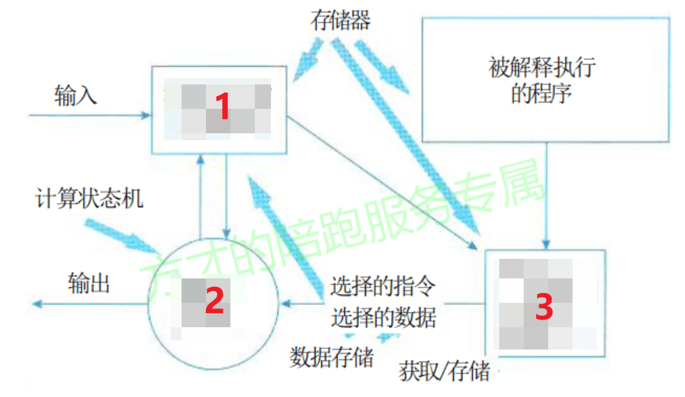
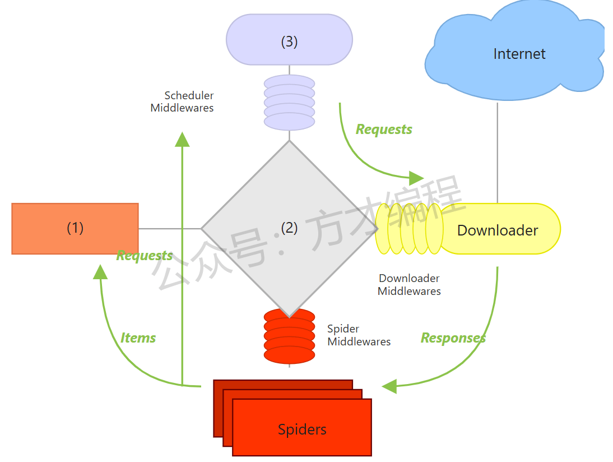
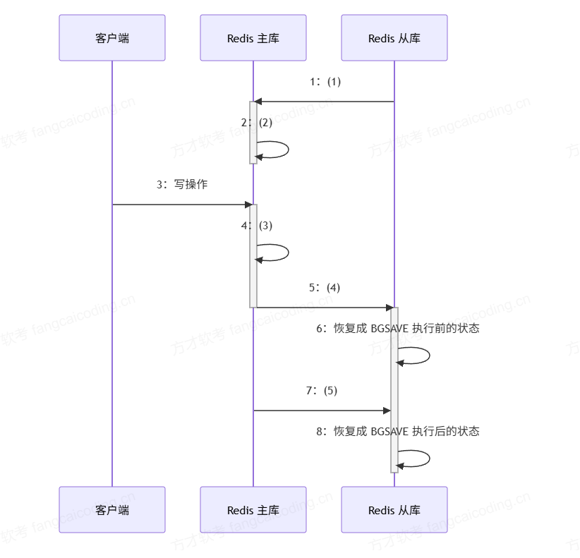
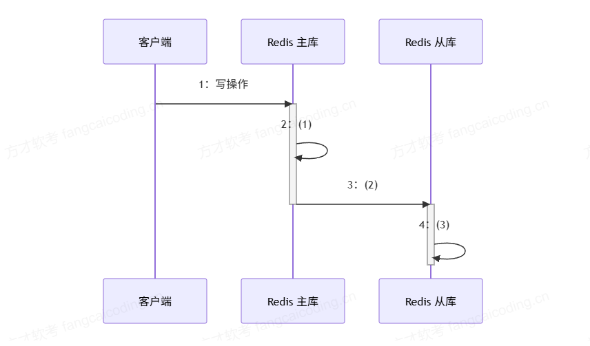
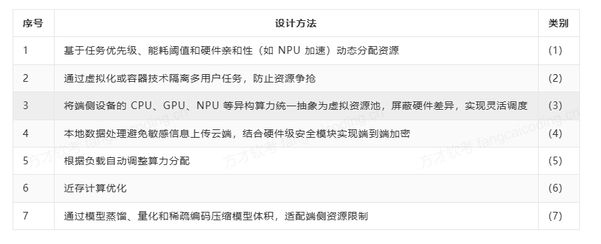
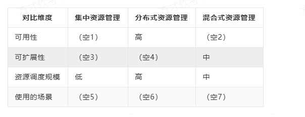

# 2025年5月 系统架构设计师 案例分析真题

> 来源：方才coding 软考真题

---

## 第1大题：软件架构设计与评估

某公司开发一个在线大模型训练平台，支持Python代码编写、模型训练和部署，用户通过python编写模型代码，将代码交给系统进行模型代码的解析，最终由系统匹配相应的计算机资源进行输出，用户不需要关心底层硬件平台。
### 问题1
（12分）列举了所有需求列表，填写对应的质量属性：
a、系统发生错误时，不影响正常运行时发送一个消息给系统管理员
b、方便用户操作，满足一般用户使用的快捷键设置
c、系统界面适配用户提供的屏幕尺寸比例
d、用户提交训练任务时应该在一分钟内提供硬件和资源，并开始任务运行
e、数据库发生故障时，能够在 20 分钟内切换至备用数据库，保证平台继续运行
f、系统出现故障时，平台能够继续正常运行并通知管理员，同时应提供相关的操作日志、系统日志、访问日志和调试日志等信息
g、支持远程用户进行测试和操作，但需限定为注册用户
h、系统应支持来自不同终端设备（如浏览器、命令行工具、移动设备等）和操作系统（如 Windows、Linux、macOS）的注册用户同时远程访问与操作平台，系统需能正确解析并响应各类客户端的指令，保证功能一致性与协同操作能力
i、当系统功能需要调整时，应在 3 天内完成功能修改和部署上线
j、系统支持切换不同的语言，方便不同语言背景用户使用
k、服务器发生故障后，立即切换到备用服务，保证业务的连续性
l、系统需具备良好的异常容错机制，部分模块出错不应影响平台整体运行

---

### 问题2
（ 13分）解释器风格架构的组成图填空（6分），以及解释为什么该模型平台适合解释器风格（7分）

---

## 第2大题：系统建模与分析

公司想要建设一个医院的智能问答系统，建立医院知识图谱，某工认为互联网的关键字检索无法满足大量的数据需求，建议建立知识图谱，采用爬虫技术。

### 问题1

知识图谱一张填空的图9分。
根据题干描述的内容，将下列选项填入图中合适位置
(a)知识检索    (b)模板翻译  (c)数据清洗    (d)命名实体识别   (e)知识表示   

(f)模板匹配      (g)问题分类     (h)知识抽取    (i)关系抽取

### 问题2
建立医院知识图谱，给出一张爬虫架构图，要求按图填空。并简述异步io的特点和优势。

---
### 问题3
在构建医药知识图谱系统中，选择哪类数据库更适合存储知识图谱数据?并结合医药数据特性说明理由。

---

## 第3大题：数据库与系统设计

某互联网企业开发了一个电商系统，系统中的商品信息、用户购物车、热销榜单等高频数据均存储在 Redis 中以提高访问效率。随着业务规模扩大，单实例 Redis 出现了性能瓶颈和单点故障风险。为提升系统的可用性、扩展性和数据容灾能力，技术团队决定采用 Redis 的主从复制架构，将写操作集中在主节点（Master），将读操作分散到多个从节点（Slave）中。同时，系统还需支持主从自动同步机制，确保在主库故障后可以快速切换至从库，保障业务连续性。
### 问题1
（10分）redis主从同步，要求按图填空，首次全量同步过程；

### 问题2
（6分）增量复制的流程图填空。

---

### 问题3
（9分）数据库持久化方案，请列举两种，并说明。【ps：这个问题的题目并没有明确提及是Redis的持久化，
问的就是数据库的持久化，同时结合本题上下文，回答Redis的持久化机制是更加合适
】

---

## 第4大题：Web应用架构

随着人工智能技术的发展，AI计算能力的部署方式呈现多样化趋势，主要包括云侧AI与端侧AI两种模式。两种部署模式各具优势，适用于不同的应用场景。
### 问题1
(6分)云端AI和端侧AI的定义以及端侧AI相比云端AI的优势是什么?

### 问题2

---
(7分)资源池的核心架构设计需要考虑以下三个方面:(a)资源抽象与异构计算(b)动态调度与能效优化(c)安全机制与隔离
下表列出了一些资源池设计方法，请将相应的类别填入下标空格处。

### 问题3

请根据下列指标对比三种资源池架构，前4空填写“高”中"或“低”，后3空填写相应资源池的典型适用场景。

---

## 第5大题：嵌入式与实时系统

某市农业信息化管理部门计划建设一个基于区块链的农产品全流程溯源平台，实现从农田到餐桌全过程的数据上链，提升农产品质量追溯的透明度和可信度。为此，项目团队需对区块链的技术架构和各个层次进行深入理解和设计。
### 问题1
（12分）请简要说明区块链技术的六个层次，并简要描述每一层的功能和作用。

### 问题2
（9分）区块链应用在农产品的检验流程中，有三个角色，数据录入者，检查者，核验者，请说明三个角色在检验流程中具体会怎样？

### 问题3
（4分）智能合约是什么？

---

## 附录：提取的图片

- `img_qr_5b2991402eee.png`：微信小程序二维码，已省略
- `img_logo_fb5107e4dc49.jpeg`：站点 Logo，已省略
- `img_exam_70b4eb5c354f.png`：第1大题第2小题架构图/表格图
- `img_exam_47a5a936cdd0.png`：第2大题第1小题架构图/表格图
- `img_exam_14d93de87af4.png`：第2大题第2小题架构图/表格图
